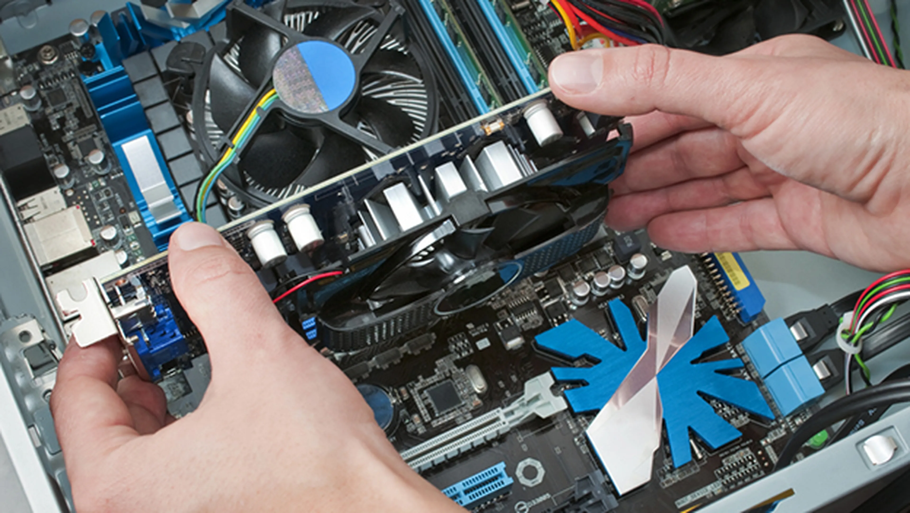

# Curso de mantenimiento y montaje de equipos
<DOCTYPE html>
<html>
 <head></head>
    <body>
        
        En este curso vas a aprender las bases del montaje de ordenadores y como hacer su correcto mantenimiento
        

        Para instalar nuestro docker compose con la academia hay que seguir los siguientes pasos
        

        1. En el directorio donde quieras instalar nuestro docker compose, git clone https://github.com/PacoCroissant/docker-esau-moodle
        

        2. Ahora subiras el docker compose, sudo docker-compose up
        

        3. Ahora desde el navegador, accederas al localhost
        

        3. ¡Ahora queda aprender!
        

        

        Le agradecemos que nos elija a nosotros para aprender

</body>

</html>